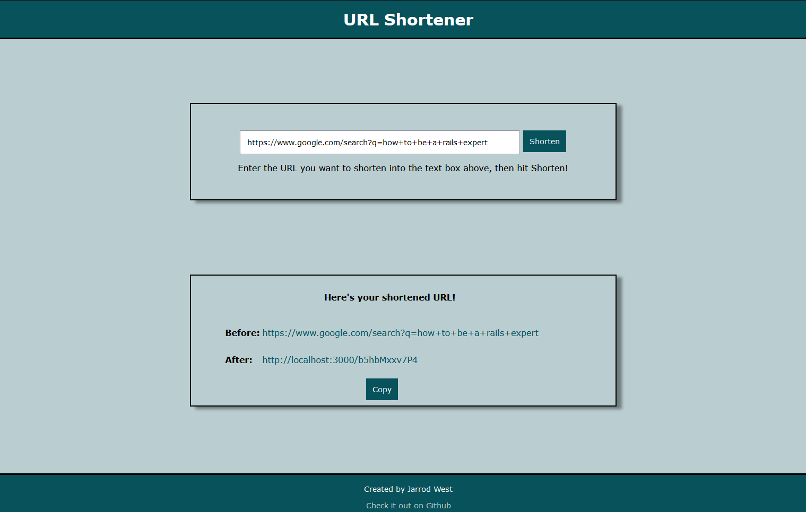

# url-shortener

## Overview

A common interview question is to design a url-shortener application: a service which takes a URL and provides a
smaller URL on the shortener's domain that redirects to the page.  Specifically:

* User navigates to the main page
* User submits their URL
* Service generates a random suffix for the shortened URL and saves it
* Service sets up a route to the shortened URL, and automatically redirects GET requests to the original URL

This is my take on the problem, completed as a refresher to get back to RoR after a couple of years working in other languages and frameworks.

## Implementation

This project has been built in rails with a single model and controller representing the URL itself.  As there is just the one model item, the root directory has been set as the URL index.  The shortened URL suffix is generated using the `urlsafe_base64` function of `SecureRandom`.

## Limitations

This is a simple POC with a number of restrictions/limitations, including:
* Not handling conflicts in the randomly generated URL suffix
* Not sanitising the inputs, which could be a security issue
* Using the default SQLite database for simplicity
* Obviously, the length of the resulting URL will also depend on how short the base domain is - that has been considered out of scope for this demo application
* Never expiring the URLs - in many similar applications, the free-tier requires the URL to be accessed frequently or else it will expire. Without this the database will eventually become clogged, increasing the rate of conflicts and rendering the application unusable